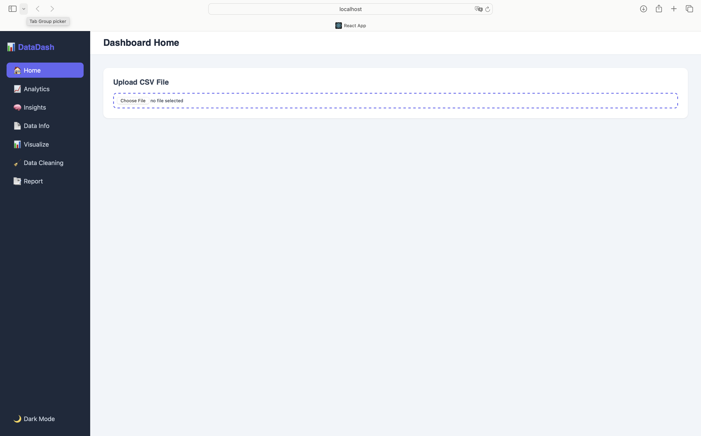
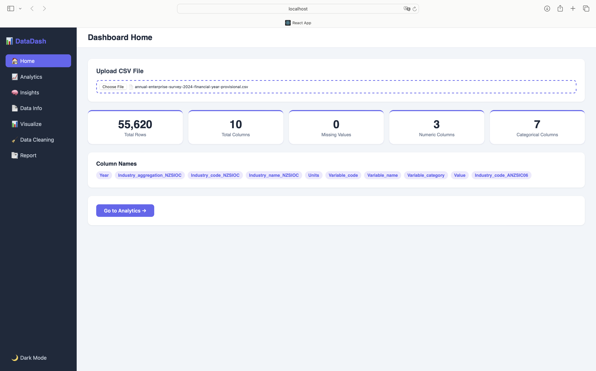
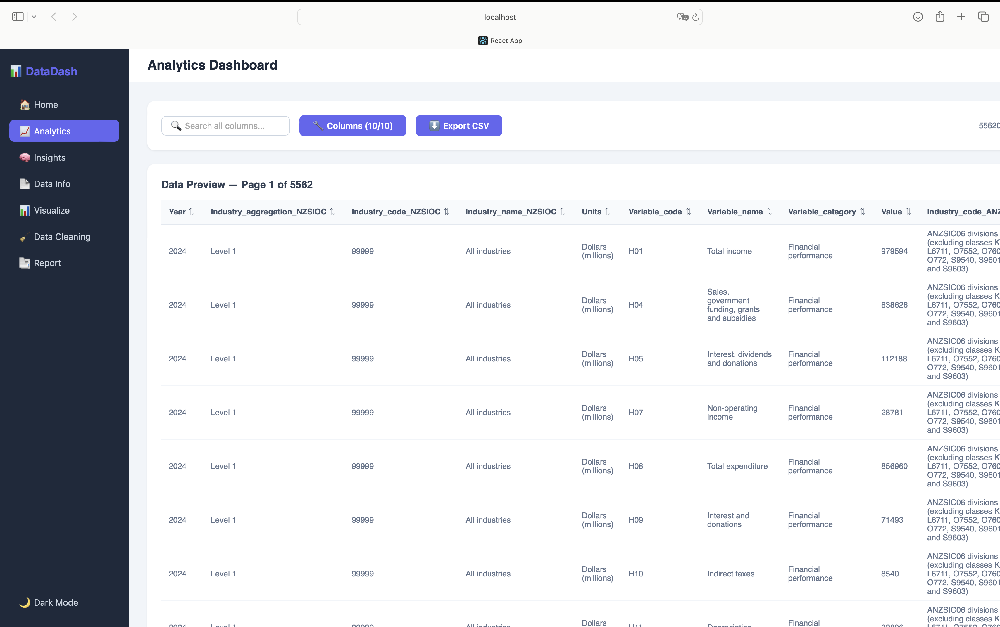
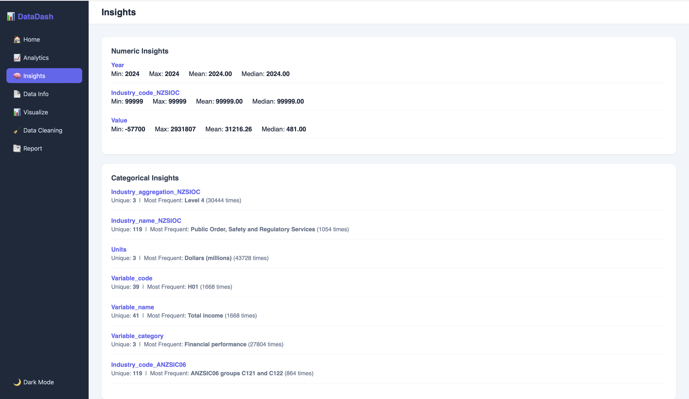
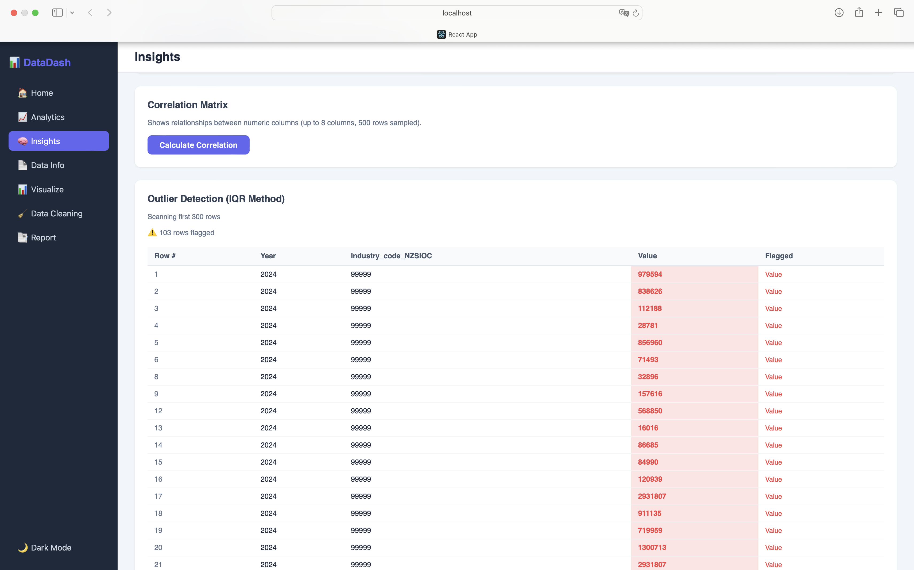
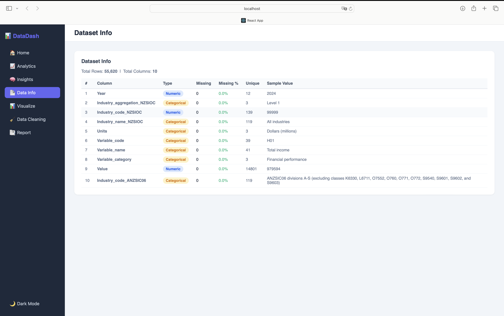
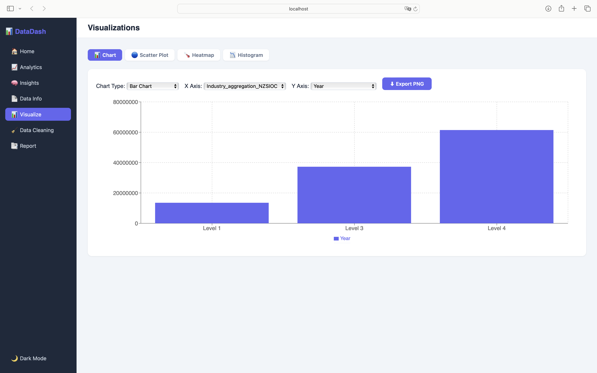
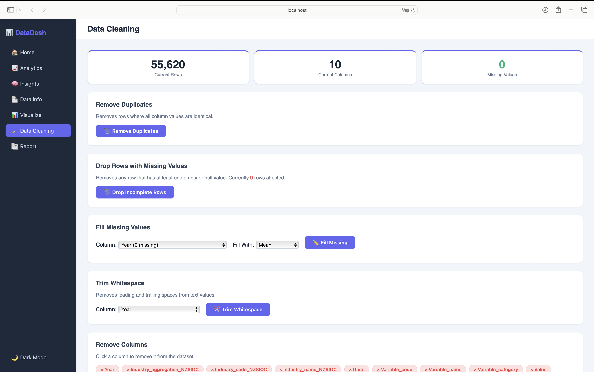
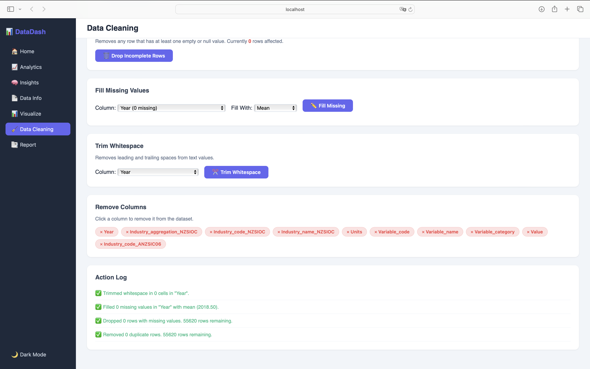
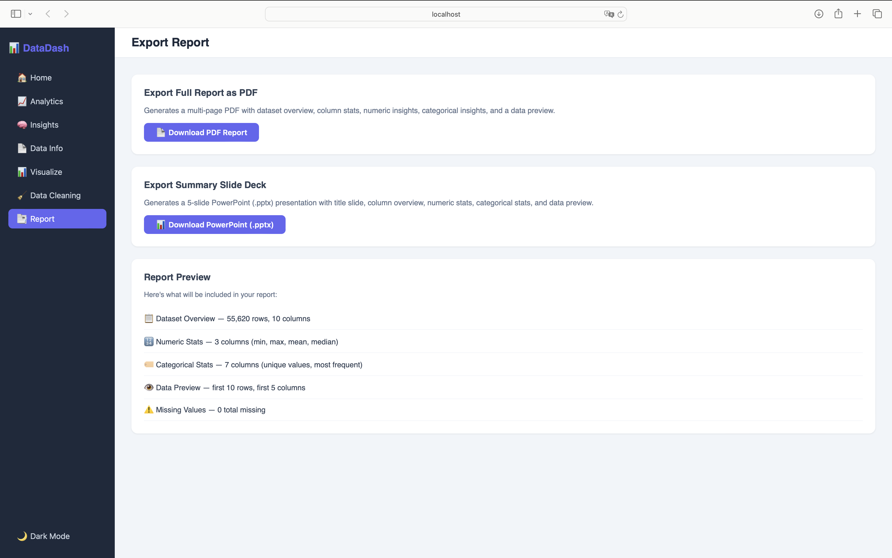

> Live Demo :-
https://data-analytics-dashboard-xi.vercel.app

> Description :-

A react based csv data analytics dashboard that allows users to upload CSV files and generate meaningful insights through interactive visualizations like bar charts, pie charts, scatter plots, and histograms. It is built to simplify data exploration for non-technical users while still offering powerful analytics capabilities.

> Features :-
This dashboard is organized into multiple sections to help users easily explore, analyze, and manage their data:

- Home  
Upload CSV files and get an instant overview including total rows, columns, missing values, numeric and categorical columns, along with column names.  

- Analytics  
Explore the complete dataset in a structured table format with column-wise navigation and full data preview.  

- Insights  
Generate deeper analysis including numerical and categorical insights, correlation matrix, and outlier detection using the IQR method. 

- Data Info  
View detailed metadata such as column types, missing value percentages, unique values, and overall dataset statistics. 

- Visualize  
Create interactive charts like scatter plots, heatmaps, and histograms with customizable axes and chart types, and export visualizations as PNG files.  

- Data Cleaning  
Clean and prepare data by removing duplicates, handling missing values,trimming whitespace, dropping incomplete rows, and removing selected columns, with an activity log for tracking changes.

- Reporting  
Generate and export full reports as PDF or summary slide decks, with a built-in preview feature.  

- Dark/Light Mode  
Switch between light and dark themes for a better user experience.

> Application Preview :-

- Home Page  

- File Upload  

- Analytics View  

- Insights  
  

- Data Info  

- Visualization  

- Data Cleaning  
  

- Reporting  

> Conclusion :-
A full featured data analytics dashboard designed to simplify data exploration, visualization, and reporting.
